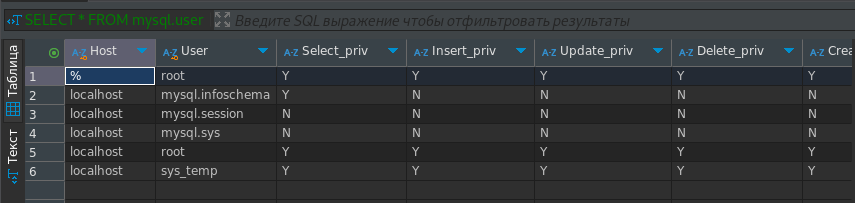
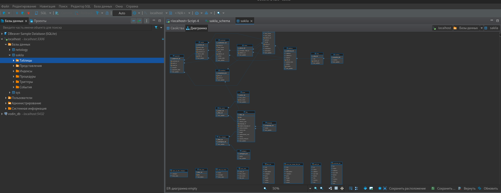

### Задание 1

Скриншот-1 к заданию 1:



Скриншот-2 к заданию 1:


Скриншот-3 к заданию 1:



```
SELECT * FROM mysql.user;

GRANT ALL PRIVILEGES ON *.* TO 'sys_temp'@'localhost' WITH GRANT OPTION;

SHOW GRANTS FOR 'sys_temp'@'localhost';

ALTER USER 'sys_temp'@'localhost' IDENTIFIED WITH mysql_native_password BY '12345';
```


### Задание 2


| Таблицы             | Ключи           |
| -------------------------- | -------------------- |
| payment                    | payment_id           |
| rental                     | rental_id            |
| customer                   | customer_id          |
| inventory                  | inventory_id         |
| store                      | store_id             |
| staff                      | staff_id             |
| address                    | address_id           |
| city                       | city_id              |
| country                    | country_id           |
| film                       | film_id              |
| language                   | language_id          |
| film_actor                 | actor_id, film_id    |
| actor                      | actor_id             |
| film_category              | film_id, category_id |
| category                   | category_id          |
| film_text                  | film_id              |
| sales_by_film_category     |                      |
| sales_by_store             |                      |
| actor_info                 |                      |
| film_list                  |                      |
| nicer_but_slower_film_list |                      |
| staff_list                 |                      |
| customer_list              |                      |
